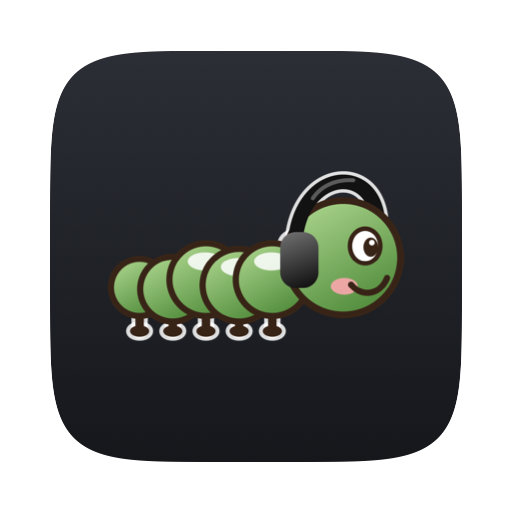
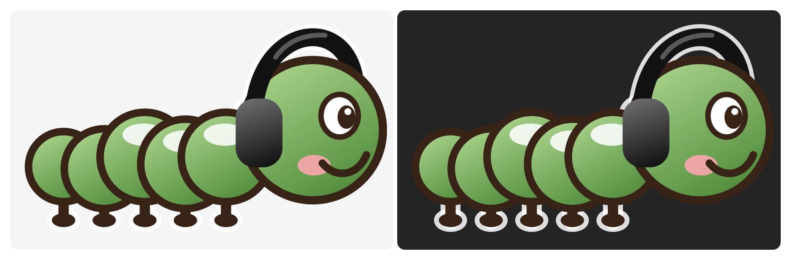

# SoundChain

<p align="center"></p>

<p align="center">Part of <strong><a href="https://menumon.nicksmith.software">Menumon</a></strong>.</p>

<p align="center"></p>

A standalone macOS menu-bar app that runs **one chain of Audio Unit effects over
all of your Mac's audio**: EQ, room correction, limiting, anything installed as an
AU effect. Pick effects, open their own editors, and the processed sound plays
through whatever output is current.

Built on [StatusItemKit](https://github.com/nicholaspsmith/StatusItemKit).

**Version 1.8.0** · [Changelog](https://github.com/nicholaspsmith/soundchain-menubar/releases)

<p align="center"></p>

## Requirements

- macOS 14.2 or later (Core Audio process taps).
- Xcode Command Line Tools, and
  [StatusItemKit](https://github.com/nicholaspsmith/StatusItemKit) cloned
  **beside** this repo (the package depends on `../StatusItemKit`).
- Audio Unit effects (AUv2 or AUv3). VST3 is not supported.

## Install

```sh
cd ~/Code
git clone https://github.com/nicholaspsmith/StatusItemKit.git
git clone https://github.com/nicholaspsmith/soundchain-menubar.git
cd soundchain-menubar && ./install.sh
```

`install.sh` builds `build/SoundChain.app` (via StatusItemKit's
`make-app.sh`), symlinks it into `~/Applications`, asks whether to turn on
Start at Login, then (re)launches the app. On first launch, allow **System
Audio Recording** when asked.

Start at Login is also in **Settings ▸ Start at Login**, or run the installed binary:
`"$HOME/Applications/SoundChain.app/Contents/MacOS/SoundChain" --login on`
(or `off`, `status`).

## Use

- **Audio Chain…** (⌃C) opens the chain. **Add…** searches installed effects;
  Pro-Q, Pro-L 2 and Nectar 3 are pinned at the top. Drag rows to reorder, untick
  one to bypass it, **Open** shows its own editor, **–** removes it (and selects the
  next row, so you can keep pressing).
- **Duplicate** (⌘D) adds a copy of the selected effect to the end of the chain,
  with its current settings (read from the running plugin, not the last save) and
  the same on/off state. **⌘C** copies the selected effect; **⌘V** pastes it directly
  below the selected row (at the end if none is selected) and selects it. Each
  paste is a new, independent instance, and the copy stays on the clipboard after
  the window closes. A plugin that ignores restored settings gets its defaults.
- **Names**: each row has a column for a name of your own, so two AUPitch rows
  can read "Pitch Up" and "Pitch Down". Click it (it says "Add a name" until you
  do), or select a row and press **Rename**, Return or **⌘R**, then type and press
  Return; clicking away also saves, Escape cancels, and an empty name goes back to
  the plugin's own. The menu, editor window titles ("Pitch Down — AUPitch") and
  error lines use the custom name, and Duplicate and ⌘C/⌘V keep it.
- Below it, the menu lists every effect in the chain, in order (by its custom
  name when it has one), with a tick when it's on. Click one to switch it on or
  off, as its checkbox in Audio Chain… does; the menu stays open, so you can switch several in one go.
- **Bypass** turns all processing off; audio passes through untouched. Ticking
  it (or an effect) updates the status line at the top in place.
- **Settings ▸** holds Start at Login and the running version (StatusItemKit's
  shared `SettingsMenu`); **Quit SoundChain** (⌘Q) is below it.
- Settings save to `~/Library/Application Support/SoundChain/chain.json`, including
  each plugin's own state (captured when its editor closes, every 5 s while one is
  open, and at quit).

### The caterpillar

The menu-bar icon is Carol, a caterpillar in headphones. Each running effect
highlights one of her five segments, counting back from the head. Green means
processing, grey means bypassed, red means something needs attention (the menu
says what).

Now and then Carol runs on the spot for a second. When several Menumon
mascots are running they take turns, a second apart: Archimedes (Claude
Usage), Menu Pimp (Mac Daddy), Carol (SoundChain), Iguanamous (VPN & DNS),
then Armonitor (Monitor Lizard), counting only the ones that are running.
Skipped when Reduce Motion is on.

### Virtual outputs and UAD plugins

SoundChain follows whatever output macOS picks, including a virtual one such as
BlackHole, Zoom's, or a driver an uninstalled app left behind. Those have no
speakers, so when the current output is virtual the caterpillar turns red and the
menu says **⚠ Virtual output: may be silent** under the device name. macOS can
pick one on its own when headphones disconnect; choose a real output in Control
Center, or remove the stale driver from `/Library/Audio/Plug-Ins/HAL`.

UAD-2 plugins (the "UAD …" ones, not native "UADx") run on the DSP in an Apollo,
Satellite or UAD-2 card. With none attached, or the moment one is unplugged,
SoundChain pauses them: they leave the chain (the rest keeps running), their editors
close, and their last saved settings are kept. The caterpillar turns red, the menu
says **⚠ No UAD hardware: N paused**, and those rows in Audio Chain say why.
Reconnect the device and they load again on their own.

### Silent Bluetooth headphones

Bluetooth headphones sometimes go silent while macOS still lists them as the
output, and disconnecting and reconnecting them brings the sound back. When the
current output is Bluetooth, the menu has **Reconnect <name>**, which does exactly
that. It first saves the last 5 minutes of Bluetooth and audio logs to
`~/Library/Logs/SoundChain/bluetooth-<name>-<time>.log`, so a recurring cause can
be tracked down later. The first use asks for Bluetooth access.

## Pinned effects

Click the pin beside any effect in **Add…** (or right-click ▸ Pin) to keep it in the
**Pinned** group at the top; click again to unpin. Pro-Q, Pro-L 2 and Nectar 3 start
pinned. Pins match name prefixes, so "Pro-Q" covers Pro-Q 3 and Pro-Q 4.

## How it works

A Core Audio process tap on the current output device captures every app's output
to it, except SoundChain's own, channel for channel, and mutes the originals. The
chain processes the device's preferred stereo pair (Audio MIDI Setup ▸ Configure
Speakers; channels 5 and 6 on an Apollo) and writes it back to the same channels;
any other channel passes through untouched. The tap and the current default output device are
joined in a private aggregate device; its IO callback runs the effects in order
and writes to the output. Chain edits build a new immutable render snapshot on
the main thread and swap it in atomically, so the audio thread never waits. The
aggregate uses tap auto-start, so while nothing is playing there is no audio work
at all.

## When things go wrong

- **SoundChain crashes:** the private tap and aggregate vanish with it, so macOS
  plays your audio unprocessed.
- **A plugin crashes it:** loading a plugin, restoring its saved settings and
  building its editor are each bracketed by an on-disk marker, and nothing new goes
  live while a plugin is loading. After a crash, a plugin caught mid-load or
  mid-editor is disabled: never loaded again, and listed last in **Add…**, greyed
  out (right-click ▸ **Re-enable** to give it another chance). One caught
  mid-restore keeps running with its saved settings reset. The menu says which.
- **Unexplained crashes:** two in a row start the next launch bypassed.
- **A plugin fails to open** (missing, unlicensed) or reports a render error: it
  stays in the chain in red and is skipped, with its settings kept. **Retry** in the
  menu, or unticking and re-ticking a slot, tries it again.

## Troubleshooting

- `SoundChain --selftest` renders a sine through Apple's AUs offline and checks the
  chain, the runner and disabled-plugin handling.
- `SoundChain --taptest 20` runs the real tap with no effects for 20 seconds. Run
  it from the bundle so macOS attributes the permission to SoundChain:
  `open -W --stdout /tmp/tap.log build/SoundChain.app --args --taptest 20`.
  The callback count stays 0 until some app plays audio (tap auto-start).
- Diagnose with `log show --predicate 'process == "SoundChain"' --last 10m`.

## Known limits

- Older (AUv2) plugins run inside SoundChain's process, so a plugin that crashes
  takes SoundChain with it (audio falls back to unprocessed).
- On an output device that also has inputs (a Scarlett, say) macOS logs one
  Microphone permission request at start. It is refused silently and audio works.

## Development

```sh
swift build
swift test             # SoundChainCore: chain model, store, crash guard, routing
scripts/build-app.sh   # builds build/SoundChain.app
```

`SoundChainCore` holds the model and policy logic with no audio-hardware
dependency; the `SoundChain` target is the tap engine, plugin host and UI, and
`CAtomics` provides the atomics shared with the audio thread (the render-snapshot pointer and flags). Before a
release, walk through [`docs/e2e-checklist.md`](docs/e2e-checklist.md) with
music playing.

## Releasing

Every push to `main` is a release. Before pushing, add a dated
`## [X.Y.Z] - YYYY-MM-DD` section to the top of [`CHANGELOG.md`](CHANGELOG.md)
(minor for features, patch for fixes; turn a waiting `## [Unreleased]` into
it). When it reaches `main`, GitHub tags `vX.Y.Z` and publishes the section as
a release titled `vX.Y.Z`. Without a new version, the `pre-push` hook refuses
the push, a pull request cannot merge (`release / check` is required), and a
push that reaches `main` fails the release workflow. The one exception is
`[no release]` in the tip commit's message, for changes nothing a user runs
(setup, CI, developer docs). Never tag or create a release by hand, and never
`gh pr merge --admin` past a failing check. See
[StatusItemKit — Releases](https://github.com/nicholaspsmith/StatusItemKit#releases-every-push-is-one).

## License

Copyright (c) 2026 Nicholas Smith. Licensed under the
[Mozilla Public License 2.0](LICENSE). You may use, modify, sell and
redistribute this software, including inside proprietary products, provided
the copyright notice and license stay on these files and any modified
versions of them are made available under the same license.
